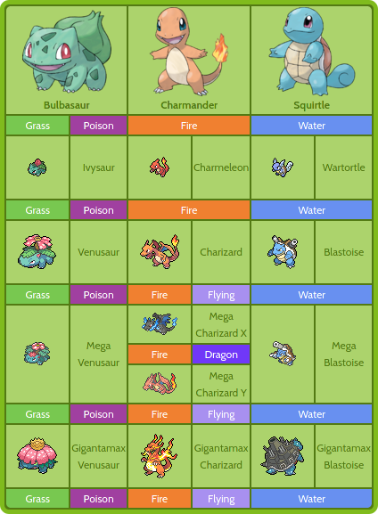

Quickstart
==========

The Pokédex package contains basic information about the three
`starter Pokémon <https://bulbapedia.bulbagarden.net/wiki/Starter_Pok%C3%A9mon>`_
from the `core series`_. These are detailed in :doc:`apidocs`.

.. _starter:

About starter Pokémon
---------------------

.. _startpoke:

   Starter Pokémon from the core series.

As you can see in the :ref:`startpoke` image, these starter Pokémon have
different types and abilities, and will evolve into different creatures as their
level progresses.

Base Stats
~~~~~~~~~~

The base stats for these Pokémon can be obtained from the general
`base stats list`_. If you need to compute total damage done in battle or the
current HP for a given Pokémon, you can use :ref:`NumPy array <arrays.ndarray>`
objects.

.. _core series: https://bulbapedia.bulbagarden.net/wiki/Core_series
.. _base stats list: https://bulbapedia.bulbagarden.net/wiki/List_of_Pok%C3%A9mon_by_base_stats_(Generation_I)

=========== ====== ========== =========== ========= =========== ========= ===========
**Pokémon** **HP** **Attack** **Defense** **Speed** **Special** **Total** **Average**
----------- ------ ---------- ----------- --------- ----------- --------- -----------
 Bulbasaur    45       49         49          45        65         253       50.6
 Charmander   39       52         43          65        50         249       49.8
 Squirtle     44       48         65          43        50         250       50.0
=========== ====== ========== =========== ========= =========== ========= ===========

Pokémon details
~~~~~~~~~~~~~~~

For these three Pokémon, you can check out their pokédex entries below.

.. md-tab-set::

   .. md-tab-item:: Bulbasaur

         * Seed Pokémon
         * Type: :bdg-success:`grass` :bdg-dark:`poison`
         * Abilities: Overgrow, Chlorophyll

   .. md-tab-item:: Charmander

         * Lizard Pokémon
         * Type: :bdg-warning:`fire`
         * Abilities: Blaze, Solar power

   .. md-tab-item:: Squirtle

         * Tiny turtle Pokémon
         * Type: :bdg-primary:`water`
         * Abilities: Torrent, Rain dish

Usage
-----

You can create an instance of Bulbasaur called ``friend``, for example, by doing

.. code::

   >>> import pokedex
   >>> friend = pokedex.Bulbasaur()
